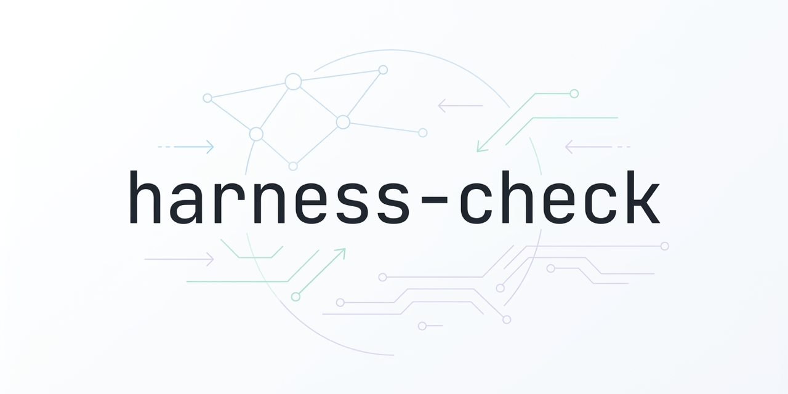

[English](README.md) | 简体中文

<div align="center">

# harness-check

<p align="center">
  
</p>

> *「文档描述的系统，和代码真能跑的系统，常常不是同一个。」*

[](LICENSE)
[]()
[]()
[]()

<br>

**多智能体 harness 的结构审查器 —— 检查"文档描述的系统"和"代码真能跑的系统"是不是同一个。**

<br>

harness-check 专审用 prompt、markdown、脚本拼起来的 agent 框架。它盯的是那些**粘合点**——一个触发词、角色发现、编排清单、一条软链、脚本衔接——任意一处悄悄断掉，整条链就静默失效，而文档还在宣称功能齐全。每条问题都在你的真实文件里实测确认（绝不靠猜），报告只讲"改前→改后行为怎么变"，不甩一堆行号。

<br>

[看效果](#效果) · [安装](#安装) · [能查什么](#能查什么) · [怎么工作](#怎么工作) · [凭什么不一样](#凭什么不一样)

</div>

---

## 效果

一次真实审计的浓缩版。你用大白话问，它用分层报告答：

```text
❯ "审查我的框架"

结论 —— 日常主路（Claude 跑测试闭环）健康、接得通：preflight 绿、零死链、
脚本参数全对得上、锁是对的。没有 XHigh/High —— 只有几条文档漂移的小问题
+ 1 条"靠模型自觉"的健壮性提示。

📊 体检评分      系统架构 5 · 触发 4 · 执行 4 · 声明vs接线 4

代码层  （审计留痕，可跳过）
  🟡 M1  脚本失败没人管 —— dim3 执行可靠性
         where: testing/test-runner.md:177-199
         why:   伪代码全程不查状态脚本的退出码 → 翻状态失败了也被当成功，
                闭环继续往下走
         fix:   加一条 Supervisor 规则「任一状态脚本非零 → 停下并上报」

✅ 可直接修（低风险）            🤔 要你拍板
  L1 主流程文件写死了 Claude        M1 给状态脚本加"非零即停"硬检查
  L2 压缩阈值对不上                    （动的是所有任务都流经的主流程，
  L3 场景数多算了一个                    你来定，不会自动改）
```

它不拿行号埋你。它告诉你 **哪条会静默断、哪些现在能安全修、哪些得你拍板**——反正框架是 AI 写的，你也不爱读它的代码。

---

## 安装

它是一个 [Claude Code](https://claude.com/claude-code) skill，丢进 skills 目录即可：

```bash
git clone https://github.com/Zane456/harness-check.git ~/.claude/skills/harness-check
```

然后随便怎么说都能触发：

```text
审查我的框架   ·   harness 体检   ·   框架可靠性   ·   review my agent framework
```

命中这些说法就自动跑完整的八步审计。

---

## 能查什么

四个维度，**25 条已知失败模式**，每条都配一个"在磁盘上怎么实测"的具体手法：

| 维度 | 这里会静默翻车的地方 |
| :--- | :--- |
| **1 · 系统架构** | 两套不连通的执行路径顶着同一个名字；文档承诺的功能在真正跑的路径上不成立；号称"丢个文件就行"实则要改脚本。 |
| **2 · 触发可靠** | 发现 glob 漏了子目录 → 角色表为空；死软链；花名册名 ≠ dispatch 名 → 按名查 404；强制 `Skill(X)` 指向一个根本发现不到的 X。 |
| **3 · 执行可靠** | 状态/递归 bug；脚本与配置参数对不上；`2>/dev/null \|\| true` 吞掉关键失败；循环上限静默截断；共享资源没加锁。 |
| **4 · 声明 vs 接线** | 纸面功能代码从没实现；健康检查校验了错的字段（绿✓ ≠ 真能跑）；空目录、硬编码路径、声明的依赖只存在一个 `.example`。 |

完整模式清单（含逐条实测手法）：[`references/failure-patterns.md`](references/failure-patterns.md)。

---

## 怎么工作

八步。每步打一行可见的 `[harness-check] …`，确保没有哪步被静默跳过。

```
0 发现机制 ─▶ 1 机械盘点 ─▶ 2 四维扫描 ─▶ 2.5 走链路 ─▶ 3 实测验证 ─▶ 4 输出报告 ─▶ 5 自检 ─▶ 6 应用修复
```

**0. 发现机制最先验** —— 框架活不活的命门：角色/skill/工具到底能不能被发现、被调起？查 glob、软链、清单完整性、命名一致性，机械部分由 `scripts/check_discovery.py` 实测。
**1. 机械盘点** —— 先把配置、规章、花名册、角色定义、脚本全读一遍再下判断，读过的文件数要和脚本打印的文件总数对账。
**2. 四维扫描** —— 对照 25 条模式清单逐维找候选问题；可 grep 的部分（吞错、空配置、硬编码路径、只有 .example 的依赖）由 `scripts/check_mechanical.py` 实测，是否要紧由模型按上下文判。
**2.5. 走链路** —— 挑一个典型任务沿真实链条走到底（触发 → 分派 → 执行 → 回报），再拿 1–2 个不该触发的任务测路由会不会误抓。
**3. 实测验证** —— 铁律：*不实测不报。* 在磁盘上证明不了的，降级为"疑似"或剔除。
**4. 输出报告** —— 结论 → 体检评分 → 代码层证据 → **✅ 可直接修** / **🤔 要你拍板**，最该看的两个静默断裂场景（触发侧 + 执行侧）折进对应条目里。报告走极简（lesstoken）、讲行为，不甩行号。
**5. 自检** —— 每个文件都评过、每条问题都实测过、每个 where 都给到 `文件:行`。
**6. 应用修复** —— 只在你明确说改之后动手：默认只改 🟢，🟡/🔴 逐条你拍板，改完重跑两个脚本证明修复落地。

---

## 凭什么不一样

| | 普通"代码审查" | harness-check |
| :--- | :--- | :--- |
| **审的对象** | 业务逻辑对不对、安全 | 框架"接线后能不能跑" |
| **证据** | 看着像就报 | 在你真实文件里实测过，证不了就丢 |
| **修复建议** | "这有个 bug" | 严重度 **+** 修复风险（🟢现在能安全改 / 🟡 / 🔴可能弄坏在跑的路径） |
| **报告口吻** | 满屏 文件:行 | 改前→改后的行为：变了什么、风险多大 |

**故意不在范围内：** 密钥泄漏、业务逻辑正确性、性能 profiling —— 它们会分散对那个唯一问题的注意力：*框架到底能不能跑。*

---

## 仓库结构

```
harness-check/
├── SKILL.md                          # 方法论 —— 八步流程
├── references/
│   ├── failure-patterns.md           # 25 条模式 × 每条怎么实测
│   ├── fix-risk-tiers.md             # 🟢/🟡/🔴 —— 每个修法的风险 + 应用修复协议
│   ├── output-format.md              # 分层报告的形态
│   └── walkthrough.md                # 端到端走链路的做法
├── scripts/
│   ├── check_discovery.py            # 机械实测：软链、glob 覆盖、名字清单
│   └── check_mechanical.py           # 机械实测：吞错/空配置/硬编码/只有 .example
├── assets/hero.png
└── README.md
```

---

<div align="center">

> *文档描述一套系统，代码跑的是另一套。*
> *harness-check 找出它们分叉的地方。*

<br>

**Zane456**

| 平台 | 链接 |
| :--- | :--- |
| 🐙 GitHub | [@Zane456](https://github.com/Zane456) |

<br>

⭐ 如果它帮你拦下了一次静默断线，给个 star 吧。

MIT License © [Zane456](https://github.com/Zane456)

</div>
